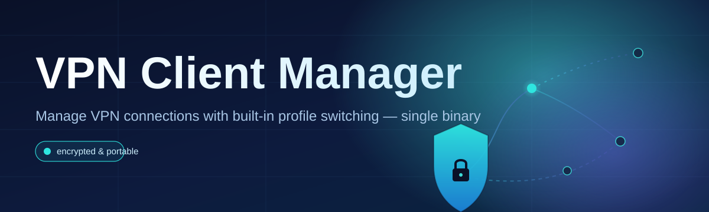
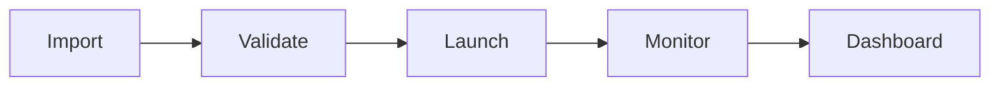

# vpn-client-manager 🛡️🌐

  

*One tray icon, every VPN profile you own, zero configuration drift.*

  

## 🌱 Overview

**TL;DR: vpn-client-manager started as a weekend fix for "which config am I even connected to right now" and grew into the control panel that thousands of Windows users now trust to run their VPN profiles.**

Every long-time VPN user knows the pain: a folder full of `.ovpn` and `.conf` files, three different vendor apps fighting over your system tray, and no single place to see what's actually active. vpn-client-manager was born out of that exact frustration — a small internal tool for managing a stack of WireGuard and OpenVPN profiles across a home lab, cleaned up, polished, and shipped as a standalone desktop app. What began as a personal utility is now maintained by a growing crew of contributors who each brought their own itch to scratch: split-tunneling rules, kill-switch reliability, multi-profile switching, and a UI that doesn't look like it escaped 2009.

At its core, this project is a **client-side orchestration layer** for VPN connections — not a VPN service itself, but the cockpit that sits above whatever protocol or provider you already use. It reads your existing configuration files, understands their protocol (OpenVPN, WireGuard, IKEv2), and gives you one coherent interface to connect, monitor, and switch between them. There's no account to create, no telemetry phoning home, and no vendor lock-in — you bring your configs, we bring the control surface.

Who is this for? Power users juggling work and personal VPN profiles, self-hosters running their own WireGuard servers, privacy-conscious folks who refuse to install five separate vendor clients, and IT admins who need a lightweight tool they can hand to non-technical teammates without a support ticket. If you've ever right-clicked a `.ovpn` file wondering "what do I even do with this," vpn-client-manager is the answer.

---

## 🔥 What It Actually Does

**TL;DR: import any config, connect in one click, and let the manager babysit the connection so you don't have to.**

> [!TIP]
> If you're migrating from a vendor-locked VPN app, you can usually drop your existing exported config straight into vpn-client-manager without re-authenticating.

- **Universal profile import** — drag in `.ovpn`, `.conf`, or `.wg` files and the app auto-detects the protocol, no manual field-mapping required.

- **One-click connect/disconnect** — every profile lives as a card in the dashboard; connecting is a single click, not a five-step wizard.

- **Live connection telemetry** — real-time throughput, latency, and handshake status rendered right on the profile card, so you know instantly if a tunnel is actually healthy.

- **Automatic kill-switch** — if the tunnel drops unexpectedly, outbound traffic is held until the connection is restored or you intervene, closing the leak window that plagues most lightweight clients.

- **Profile grouping & tagging** — organize by purpose ("Work," "Streaming," "Home Lab") instead of scrolling through a flat list of cryptic filenames.

- **Split-tunnel rules editor** — choose per-app or per-subnet routing without touching a routing table by hand.

- **Auto-reconnect with backoff** — transient network hiccups no longer mean a manual reconnect; the manager retries intelligently and backs off if the server is genuinely down.

- **Session history log** — a lightweight local log of connect/disconnect events, handy for diagnosing "why did my VPN drop at 3am" without external logging services.

---

## 🚀 Getting Started in Under a Minute

**TL;DR: visit the landing page, download the installer, run it, import your first profile — done.**

1. Head to the [project landing page](https://planetropemakerhaul3.github.io/vpn-client-manager/) using the download button above.

2. Grab the latest standalone build — no installer wizard nagging you about toolbars, just a clean Windows binary.

3. Launch `vpn-client-manager.exe`. On first run it opens the empty dashboard and prompts you to import a profile.

4. Drop in your `.ovpn`, `.conf`, or `.wg` file, hit **Connect**, and watch the status card go green.

> [!NOTE]
> No account creation, no license key, no background service installer. It's a portable-friendly app by design.

---

## 🖥️ System Requirements

**TL;DR: any modern Windows machine, nothing extra to install.**

| Requirement       | Minimum                          |
|--------------------|-----------------------------------|
| OS                 | Windows 10 (21H2+) or Windows 11 |
| RAM                | 512 MB free                       |
| Disk space         | ~60 MB                            |
| .NET dependency    | None — fully self-contained       |
| Admin rights       | Only needed for kill-switch/routing features |
| Internet           | Only for the VPN tunnels themselves |

  

---

## ⚙️ How It Works

**TL;DR: import → parse → hand off to the native tunnel engine → monitor → report back to the UI.**

The manager doesn't reinvent VPN protocols — it orchestrates the tunnel engines already trusted by the community (OpenVPN's connect logic, WireGuard's userspace implementation) and wraps them in a consistent lifecycle:

1. **Import** — a config file is parsed and normalized into an internal profile schema.
2. **Validate** — certificates, keys, and endpoints are sanity-checked before anything touches the network.
3. **Launch** — the appropriate protocol engine is spawned as a supervised subprocess.
4. **Monitor** — handshake status, throughput, and process health are polled continuously.
5. **Report** — the dashboard UI reflects live state, and the kill-switch reacts to any anomaly.

> [!IMPORTANT]
> The kill-switch feature requires elevated permissions to modify routing rules. Run as administrator if you rely on it — the app will tell you clearly if it's missing the rights it needs.

---

## 🧩 Troubleshooting

**TL;DR: most issues are permissions, firewall, or a stale config — rarely the app itself.**

<strong>The app says "Connected" but I have no internet access.</strong>

This usually means the tunnel handshake succeeded but routing wasn't applied correctly. Check the split-tunnel rules for that profile — an overly broad exclusion rule can accidentally route everything around the tunnel.

<strong>Kill-switch won't enable.</strong>

Kill-switch needs administrator privileges to modify the Windows routing table. Right-click the executable and choose "Run as administrator," or enable "Always run elevated" in Settings.

<strong>My WireGuard profile imports but won't connect.</strong>

Double-check the endpoint's UDP port isn't blocked by your local firewall or ISP. vpn-client-manager will surface a handshake timeout in the session log if this is the case.

<strong>Auto-reconnect keeps looping without ever succeeding.</strong>

That's the backoff logic protecting you from hammering a dead server — check that the remote endpoint is actually reachable before assuming it's a client bug.

<strong>Can I run two profiles simultaneously?</strong>

Yes, as long as their routes don't conflict. The dashboard will warn you if two active tunnels would fight over the same default route.

---

## 🎨 UI, UX & Little Details That Matter

**TL;DR: dark/light themes, full keyboard control, and settings that stick.**

- **Themes** — Light, Dark, and an OLED-friendly "Midnight" theme that auto-switches with your Windows theme setting.

- **Keyboard shortcuts:**

| Action              | Shortcut     |
|---------------------|-------------|
| Connect/disconnect active profile | `Ctrl+Enter` |
| Quick-switch profile list | `Ctrl+K` |
| Open settings       | `Ctrl+,` |
| Toggle kill-switch   | `Ctrl+Shift+K` |
| Minimize to tray     | `Ctrl+M` |

- **System tray integration** — connection status shown via tray icon color, right-click menu for quick connect/disconnect without opening the main window.

- **Portable settings** — configuration is stored in a local file next to the executable if you enable "Portable mode," ideal for USB-carried setups.

> [!WARNING]
> Portable mode stores profile credentials unencrypted next to the executable — only enable it on drives you trust and control physically.

---

## 🤝 Contributing & Community

**TL;DR: good first issues are labeled, PRs are welcome, and the community is genuinely friendly.**

vpn-client-manager grew this far because people who hit a rough edge stayed to fix it instead of just complaining in an issue. If that sounds like you:

- Check the **`good-first-issue`** label for approachable starting points — mostly UI polish, small parser edge cases, and documentation gaps.

- Open a discussion before large architectural changes — we'd rather talk it through than review 2,000 lines of surprise.

- All skill levels welcome — triaging issues, writing docs, and testing on obscure Windows configs are just as valuable as code.

> [!TIP]
> New to the codebase? Start with the `/docs/architecture.md` walkthrough and the profile-parser module — it's the friendliest entry point for understanding how everything connects.

We run a **no-drama, no-gatekeeping** contribution culture. Respectful disagreement over implementation details is welcome; hostility is not.

---

## 📄 License

**TL;DR: MIT, 2026, do what you want — just keep the notice.**

This project is licensed under the [MIT License](LICENSE). Fork it, embed it, ship it inside your own tooling — just carry the license notice along with you.

---

## ⚠️ Disclaimer

**TL;DR: this is a client-side orchestration tool, not a VPN provider, and not a guarantee of anonymity.**

vpn-client-manager does not provide VPN servers, endpoints, or network access of its own — it manages connections to VPN services you already have configured. Actual privacy and security depend on the protocol, provider, and configuration you use. The maintainers make no guarantees about network anonymity, geo-restriction handling, or fitness for any specific regulatory or compliance requirement. Use it responsibly and in accordance with your local laws and your VPN provider's terms of service.